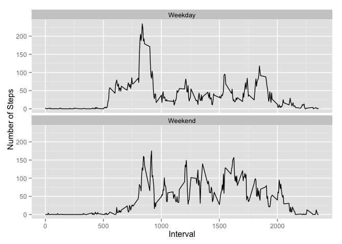

# Reproducible Research: Peer Assessment 1

This report is submitted to satisfy the Peer Assessment 1 requirement of the
Coursera Reproducible Research Course.

## Loading and preprocessing the data

We analyze data from a personal activity monitoring device.
Data was collected in 5 minute intervals throughout the day.
The data consists of two months of data provided by an anonymous
individual during the months of October and November of 2012.

First we load the data taking care to first uncompress the zip archive and to 
convert the date column from levels to Dates.


```r
activity <- read.csv(unz("activity.zip", "activity.csv"))
activity$date <- as.Date(activity$date)
```


## What is mean total number of steps taken per day?

Grouping the data by date and computing the total steps per day we observe the 
following distribution of total daily steps.


```r
library(dplyr)
```

```
## 
## Attaching package: 'dplyr'
## 
## The following object is masked from 'package:stats':
## 
##     filter
## 
## The following objects are masked from 'package:base':
## 
##     intersect, setdiff, setequal, union
```

```r
daily <- activity %>% 
         group_by(date) %>% 
         summarize(steps=sum(steps, na.rm=TRUE))
hist(daily$steps, main="Total Steps", xlab="daily steps")
```

 

In addition, we compute the mean number of steps taken per day:


```r
ave <- mean(daily$steps, na.rm=TRUE)
ave
```

```
## [1] 9354.23
```

and the median:


```r
med <- median(daily$steps, na.rm=TRUE)
med
```

```
## [1] 10395
```

Note that for this analysis we have simply ignored missing data.

## What is the average daily activity pattern?

If we look at the data averaged over the day we find the following distribution.


```r
interval <- activity %>% 
            group_by(interval) %>% 
            summarize(ave.steps=mean(steps, na.rm=TRUE))
with(interval, {plot(interval, ave.steps, type="l", 
                     main="Time Series of 5 min Intervals", 
                     ylab="average number of steps")
                })
```

 

The interval with the maximum number of steps is given by:


```r
interval$interval[which.max(interval$ave.steps)]
```

```
## [1] 835
```

## Imputing missing values

The number of missing values in the data set is


```r
miss <- sum(is.na(activity$steps))
miss
```

```
## [1] 2304
```

This represents a significant fraction of the original data set.


```r
miss / dim(activity)[1]
```

```
## [1] 0.1311475
```

We now create a new data set were we replace missing values with the mean 
value measured for the corresponding interval.


```r
# this could probably have been done more elegantly...
nactivity <- activity
for (i in 1:length(nactivity$steps)) {
    if (is.na(nactivity$steps[i])) {
        ival <- nactivity$interval[i]
        ave.steps <- interval$ave.steps[interval$interval == ival]
        nactivity$steps[i] <- round(ave.steps)
    }
}
```

Repeating the total daily step analysis we did earlier with the new dataset we 
get the following distribution for the total number of daily steps:


```r
ndaily <- nactivity %>% 
          group_by(date) %>% 
          summarize(steps=sum(steps, na.rm=TRUE))
hist(ndaily$steps, main="Total Steps", xlab="daily steps")
```

 

Imputing missing data has a significant impact on the distribution
of total daily steps, especially in the bins representing fewer steps.

As before, we compute the mean number of steps taken per day:


```r
nave <- mean(ndaily$steps, na.rm=TRUE)
nave
```

```
## [1] 10765.64
```

and the median:


```r
nmed <- median(ndaily$steps, na.rm=TRUE)
nmed
```

```
## [1] 10762
```

The change in mean and median of the total number of steps is respectively:

```r
nave-ave
```

```
## [1] 1411.41
```

```r
nmed-med
```

```
## [1] 367
```

## Are there differences in activity patterns between weekdays and weekends?

Using the original dataset to avoid any contamination that might have been 
introduced by imputed data we contrast activity patterns between weekdays and 
weekends.


```r
activity$weekday <- !(weekdays(activity$date) %in% c("Saturday", "Sunday"))
weekday.interval <- activity %>% 
                    filter(weekday) %>%
                    group_by(interval) %>% 
                    summarize(ave.steps=mean(steps, na.rm=TRUE)) %>%
                    mutate(weekday="Weekday")
weekend.interval <- activity %>% 
                    filter(!weekday) %>%
                    group_by(interval) %>% 
                    summarize(ave.steps=mean(steps, na.rm=TRUE)) %>%
                    mutate(weekday="Weekend")
data <- rbind(weekday.interval, weekend.interval)
library(ggplot2)
qplot(interval, ave.steps, data=data, geom=c("line"),
      xlab="Interval", ylab="Number of Steps") +
    facet_wrap(~ weekday, nrow=2, ncol=1)
```

 

We see very different patterns of activity.
On weekdays the distribution is shifted earlier in the day.
On weekends the activity level in the afternoon is higher than on weekdays.
